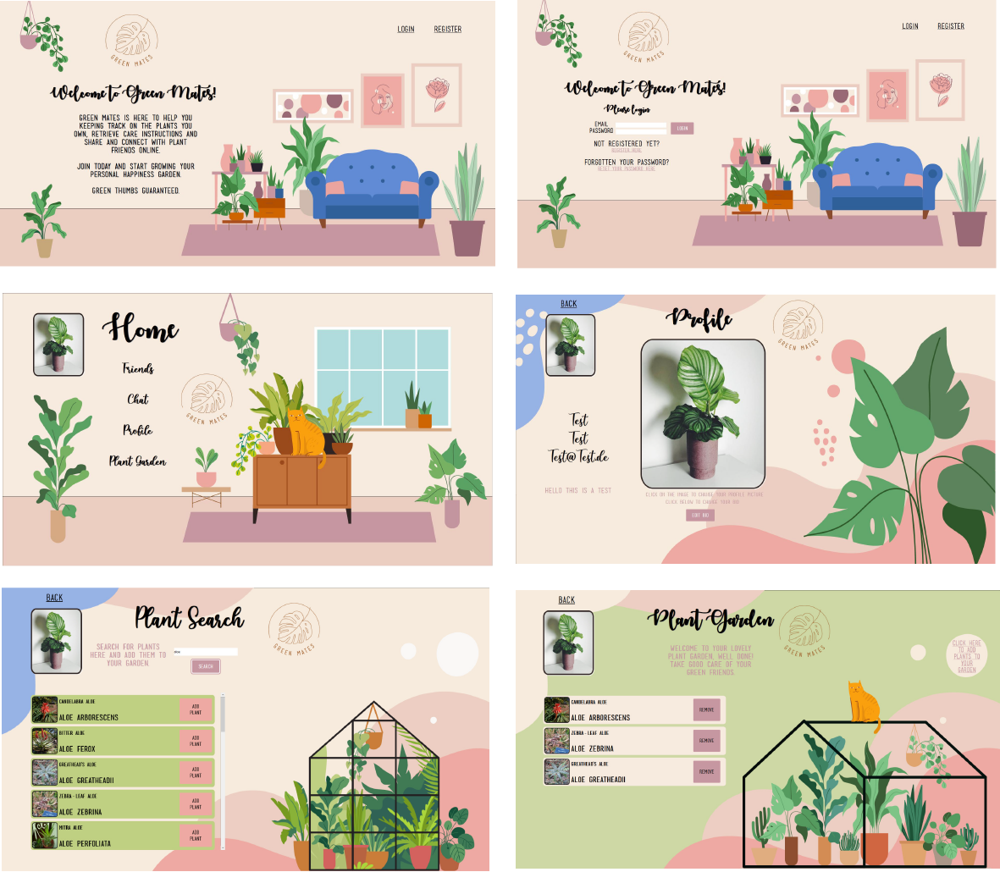

## Project GreenMates - House Plant Organizer 

Green Mates is a website for organizing your houseplants. With the functions of a social network and linked to the 'Trefle' API, you can access a database of plants and save them together with care instructions in your portfolio.

## Features: 

-   Build with React
-   Register / Login / Password-Reset / Logout
-   Create / Edit Profile Bio
-   Upload Profile Picture
-   Send / Cancel / Accept Friend Requests
-   Chat Room
-   Search Plants
-   Add / Remove Plants to your Plant Portfolio together with relevant data (if available via API)

## Preview:

## Tech Stack: 

-   React / Redux
-   Express.js
-   Node.js
-   Socket.io
-   PostgreSQL
-   Amazon Web Services
-   Express, Cookie-Session, Csurf
